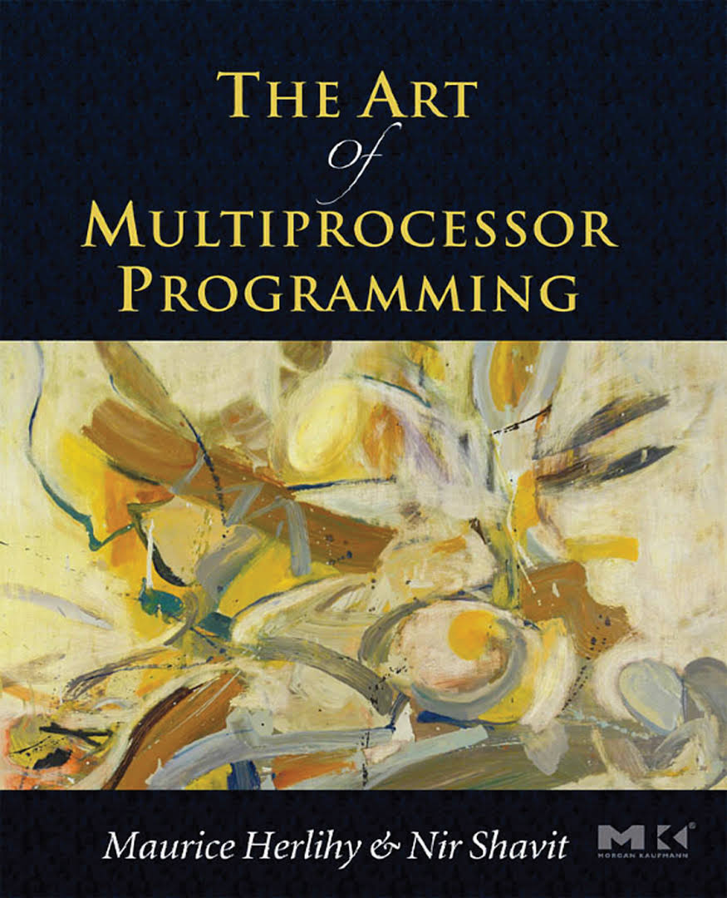

# TAOMP

The Art Of Multiprocessor Programming (TAOMP)是由Maurice Herlihy以及Nir Shavit所著的一本关于多线程编程的经典书籍。

《多处理器编程的艺术》讲述了并发编程设计的思想及理论。讨论了经典的互斥问题，共享存储器的性质以及一些并发数据结构的原理与实践。

然而书中的代码多是琐碎的片段,并且一些在概念与逻辑上完全正确的代码在Java语言实际运行环境中并不能得到正确的结果。
为了更好地通过运行这些代码学习，需要针对Java语言特性作一些修改以得到正确的结果。
本仓库代码是我在学习过程中基于书中的代码所写的Java程序示例，大体基于原书的代码逻辑与风格，并针对Java的特性稍作了一些修改，并附有单元测试验证。

## 目录
* **第二章 （互斥）**

  互斥是并发程序设计中很常见的线程协作方式。本章涵盖了基于读写共享存储器的各种经典互斥算法。
  *  [LockOne](src/main/java/com/github/mottox/taomp/concurrent/locks/LockOne.java)
  *  [LockTwo](src/main/java/com/github/mottox/taomp/concurrent/locks/LockTwo.java)
  *  [Peterson](src/main/java/com/github/mottox/taomp/concurrent/locks/Peterson.java)

* **第七章 （自旋锁和争用）**

  本章研究讨论了一些采用自旋方式的锁的设计与实现。
  *  [TASLock](src/main/java/com/github/mottox/taomp/concurrent/locks/TASLock.java)
  *  [TTASLock](src/main/java/com/github/mottox/taomp/concurrent/locks/TTASLock.java)
  *  [BackoffLock](src/main/java/com/github/mottox/taomp/concurrent/locks/BackoffLock.java)
  *  [ALock](src/main/java/com/github/mottox/taomp/concurrent/locks/ALock.java)
  *  [CLHLock](src/main/java/com/github/mottox/taomp/concurrent/locks/CLHLock.java)
  *  [MCSLock](src/main/java/com/github/mottox/taomp/concurrent/locks/MCSLock.java)
  *  [TOLock](src/main/java/com/github/mottox/taomp/concurrent/locks/TOLock.java)

* **第八章 （管程和阻塞同步）**

  本章介绍了管程的概念、管程锁、条件以及一些阻塞同步的实现。
  * [LockedQueue](src/main/java/com/github/mottox/taomp/concurrent/LockedQueue.java)
  * [SimpleReadWriteLock](src/main/java/com/github/mottox/taomp/concurrent/locks/SimpleReadWriteLock.java)
  * [SimpleReentrantLock](src/main/java/com/github/mottox/taomp/concurrent/locks/SimpleReentrantLock.java)
  * [FifoReadWriteLock](src/main/java/com/github/mottox/taomp/concurrent/locks/FifoReadWriteLock.java)
  * [Semaphore](src/main/java/com/github/mottox/taomp/concurrent/Semaphore.java)

* **第九章 （链表：锁的作用）**
  
  本章基于链表的数据结构介绍了粗粒度同步、细粒度同步、乐观同步、惰性同步、非阻塞（无锁）同步的设计与实现。
  * [CoarseList](src/main/java/com/github/mottox/taomp/concurrent/CoarseList.java)
  * [FineList](src/main/java/com/github/mottox/taomp/concurrent/FineList.java)
  * [OptimisticList](src/main/java/com/github/mottox/taomp/concurrent/OptimisticList.java)
  * [LazyList](src/main/java/com/github/mottox/taomp/concurrent/LazyList.java)
  * [LockFreeList](src/main/java/com/github/mottox/taomp/concurrent/LockFreeList.java)

## TODO
由于时间精力有限，目前书中还有一些章节的代码未更新到本仓库，或是内容还未读透。如果你有兴趣的话，可以fork本仓库代码，然后可以：
  * 补充一些章节涉及到的代码
  * 完善单元测试
  * 编写实现一些课后习题
  
在完成之后发送Pull Request一起完善。

有任何问题欢迎发Issue讨论:)

## 许可
[MIT LICENSE](LICENSE)
